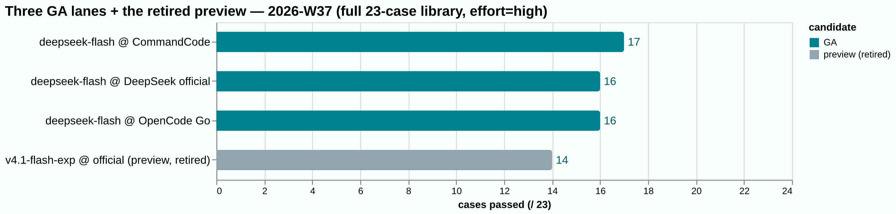
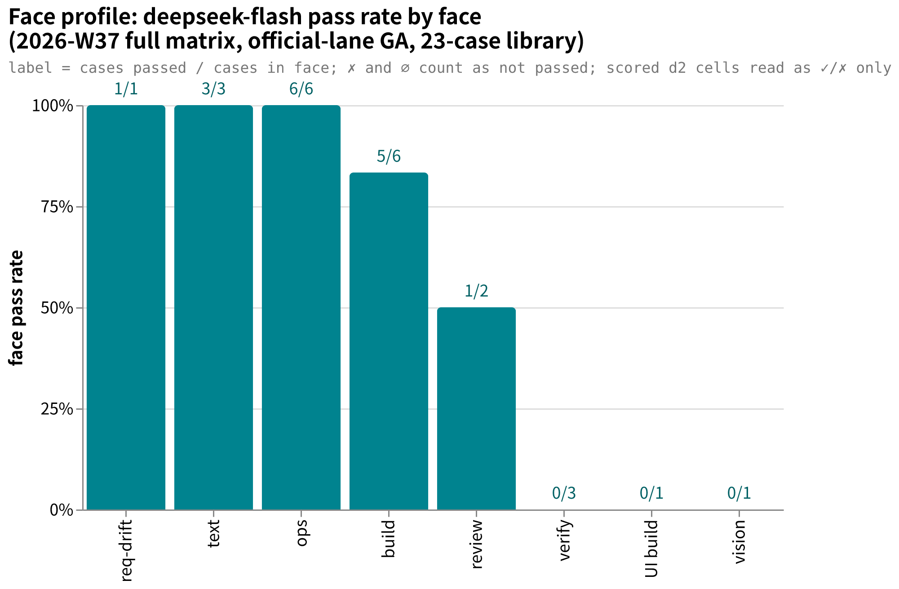

# amber-deepseek

Public periodic [AMBER](https://github.com/getaskclaw/amber) benchmark results of models on the official DeepSeek API (api.deepseek.com) — stable releases, preview builds, across reasoning-effort band (the thinking-effort setting)s. **Cases stay private; results are public.** 中文说明：[README.md](README.md)

## What this is

- A 'lane' is one vendor's shop/API for a model name; a 'case' is one task, a 'run' is one sitting (a multi-variant case has several runs).

- One `results/YYYY-Www.md` per issue: same cases, same harness (the program that runs the exam and scores it), full library per model; same-family versions and providers side by side.
- Each issue pins: library size and hashes, per-case defect-hunt score and pass/fail, terminal states (how the run process exited), token usage (when the lane reports it) and latency, environment fingerprint, and a qualitative verdict written under evidence discipline.
- Cases, oracles, transcripts (full answer logs)s and intermediates are **never published**.
- Sister repos: [amber-gpt](https://github.com/getaskclaw/amber-gpt), [amber-crof](https://github.com/getaskclaw/amber-crof), [amber-ollama](https://github.com/getaskclaw/amber-ollama), [amber-devin](https://github.com/getaskclaw/amber-devin), [amber-opencode](https://github.com/getaskclaw/amber-opencode) (OpenCode Go lane), [amber-commandcode](https://github.com/getaskclaw/amber-commandcode) (CommandCode lane), [amber-workbuddy](https://github.com/getaskclaw/amber-workbuddy) (WorkBuddy ACP lane), [amber-doubao](https://github.com/getaskclaw/amber-doubao), [amber-goldenpotato](https://github.com/getaskclaw/amber-goldenpotato), [amber-kimi](https://github.com/getaskclaw/amber-kimi), [amber-stepfun](https://github.com/getaskclaw/amber-stepfun). Third-party-vendor scores for the same deepseek-v4 family live in those repos; **same-name cross-vendor duels** (official API / OpenCode Go / CommandCode — the same name may not be the same endpoint) live in the latter two. This repo's comparison axis is **cross-version on the official lane**, and every cross-repo citation carries an explicit date and band declaration.

## W37 in one minute

Same v4.1 brain, GA day (2026-09-10), same effort=high, same 23 cases and hashes, three lanes side by side: **CommandCode 17 / DeepSeek official 16 / OpenCode Go 16**; the gray official preview (retired) sits at 14 for contrast. Per-case matrix, token bill and regression faces are in the [2026-W37 issue](results/2026-W37.md). Chart sources live next to the PNGs (`docs/images/`, Vega-Lite). Note 2026-09-13: two more same-brain lanes have since published — Ollama 17/23 (09-11) and WorkBuddy ACP 15/23 (09-12); see [amber-ollama](https://github.com/getaskclaw/amber-ollama) / [amber-workbuddy](https://github.com/getaskclaw/amber-workbuddy).

## Publication red lines

1. Publish only: scores and aggregates, token usage (when reported), speed, qualitative verdicts.
2. Never publish: case content, oracles/graders, transcripts, candidate workspaces, anything that could reconstruct a case.
3. Every issue pins: model ID, effort band, date (UTC), harness version, per-case bundle hash — verifiable against the public hash index in [amber](https://github.com/getaskclaw/amber).
4. Case numbering is private: public matrices use stable aliases (A-xxxxxxxx, hash-derived) plus bundle hashes only.
5. Tone: community measurement, not vendor attacks.

## A methodological premise

Same model name, same provider, two runs can still score differently — inference parameters, load, and server-side versions drift. Preview/experimental models also carry lifecycle risk (they can vanish overnight). Every conclusion here is dated and banded, and we re-test periodically. A single day's number is a snapshot, not a law.

## Charts

- **Face profile** (2026-W37 full matrix, the stable deepseek-flash on its GA-day full-library run, grouped by face): ops 6/6, text 3/3 and build 5/6 are the strengths; verify 0/3, vision 0/1 and UI build 0/1 still fail. Per-case matrix in the [2026-W37 issue](results/2026-W37.md).
  

## Results index

| Issue | Candidate | Score (23 / public 21) | Headline |
|---|---|---|---|
| [2026-W37](results/2026-W37.md) | **deepseek-flash** (GA, on GA day) | **16/23** (14/21) | blank-paper and clean-review regressions fixed; three-lane band; deferred exams closed; 0.75M input, family low; review/vision/UI still fail |
| [2026-W37](results/2026-W37.md) | deepseek-v4.1-flash-expires-on-0910 (preview, retired) | 14/23 (12/21) | zero invalid scored papers; ~1/30 the input tokens of its 0731 siblings; strong build/ops; vision case overturned and retaken (see Errata/Addenda) |

## Disclaimer

Not affiliated with or sponsored by DeepSeek. Scores are dated, band-specific snapshots, not purchasing advice.
