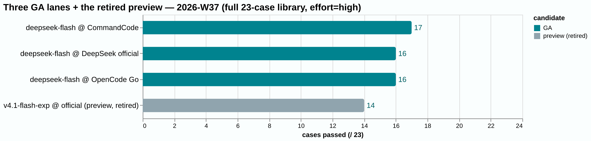
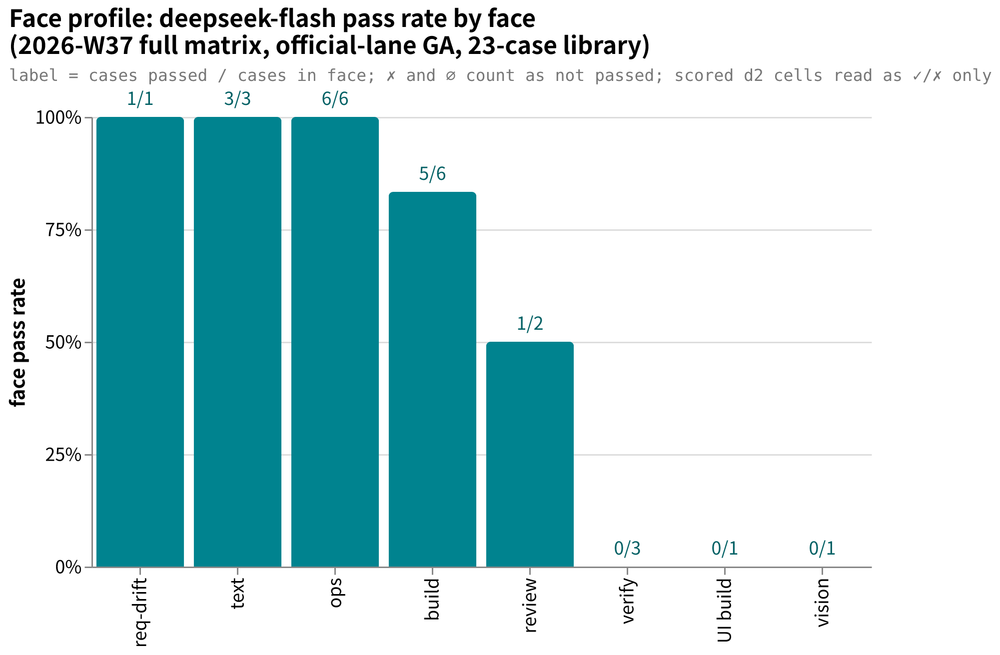

[简体中文](README.md) · English

# amber-deepseek

> ⚠️ **Correction (2026-10-02, second)**: one defense case, A-d511f9e8, is now NA on every lane (the exam room did not grade the file the model gave in, and the grader asks for something the task text does not say). The denominator and the **number of passed cases do not change**; every lane's total now carries `'`. In this repo's issue tables, read that cell as NA. Everything else stays as published; the [correction notice](https://github.com/getaskclaw/amber/blob/main/docs/corrections-2026-10-02-a-d511f9e8.en.md) governs.

> ⚠️ **Correction (2026-10-02)**: the papers below were answered by a model that left its own paper and touched grading material; they count neither as a pass nor as a fail. deepseek-flash (GA) @ DeepSeek official: 1 paper (A-a5608487) now NA, score 17/24 → **16'/24**; deepseek-v4.1-flash-exp (preview, frozen lane) @ DeepSeek official: 1 paper (A-a5608487) now NA, score 14/23∅ → **13'/23∅**. The cause was an isolation fault in our exam setup; the fault is ours. The rest of this page stays as published; where they differ, the [correction notice](https://github.com/getaskclaw/amber/blob/main/docs/corrections-2026-10-02.en.md) governs.

> **2026-10-07 update**: A-cdc3d11a (review): On one review case the grader counted every sub-point of a well-formed finding as a separate unproven claim and treated real defects outside its short answer list as false alarms, so a correct, well-formatted review could not reach the passing line; the case is held on every lane, denominator unchanged, until the grader and exam room are repaired and the case is re-sat. This lane (deepseek-flash (GA) @ DeepSeek official) goes from a loss to NA (held) on this cell, not a loss; the case moves from a loss to NA on 27 lanes; no sitting is re-run and no conclusion is drawn about any model's ability. The pass count is unchanged (16'/24 on the board); losses go 6→5 and NA 2→3; the review axis stays 1/2 with 1 NA. The cell is updated in the GA column of the Full matrix in the [2026-W37 issue](results/2026-W37.md); the other columns and the charts are untouched. See the [amber spec repo correction of 2026-10-07 (A-cdc3d11a)](https://github.com/getaskclaw/amber/blob/main/docs/corrections-2026-10-07-a-cdc3d11a.en.md).

Public periodic [AMBER](https://github.com/getaskclaw/amber) benchmark results of models on the official DeepSeek API (api.deepseek.com) — stable releases, preview builds, across reasoning-effort band (the thinking-effort setting)s. **Cases stay private; results are public.**

## Scoreboard

<!-- scoreboard:start -->

| Group | Axis | What it tests | deepseek-flash (GA) · [W37](results/2026-W37.md) |
|---|---|---|:-:|
| Building | Coding | Implement the spec correctly | 5/6 |
|  | Delivery | Done means handed in | 3/3 |
|  | Ops | Follow the runbook | 5/6 · 1 NA |
|  | Requirements | Ship A when A was asked | 1/1 |
|  | Convergence | Finish, don't spin | 1/1 |
| Judging | UI | Build the page to the mock | 0/1 |
|  | Vision | Spot defects in screenshots | 0/1 |
|  | Defense | Plug every hole in the validator | 0/2 · 1 NA |
|  | Attribution | Pin defects to their root cause | 0/1 |
|  | Review | Inspect someone else's work | 1/2 · 1 NA |
|  | **Total** |  | **16'/24** |

Each cell = cases passed / cases on that axis (a case is one scored task). NA = the case was voided or put on hold; it counts as neither a pass nor a fail, and a total carrying `'` contains at least one NA. Most axes hold only 1–2 cases, so one case moves the reading: do not over-read small gaps. All columns are from the same week (W37) and the test dates may differ; every number is a snapshot.

<!-- scoreboard:end -->

## What this is

- A 'lane' is one vendor's shop/API for a model name; a 'case' is one task, a 'run' is one sitting (a case with more than one variant has more runs).
- One `results/YYYY-Www.md` per issue: same cases, same harness (the program that runs the exam and scores it), full library per model; same-family versions and providers side by side.
- Each issue pins: library size and hashes, per-case defect-hunt score and pass/fail, terminal states (how the run ended), token usage (when the lane reports it) and latency, environment fingerprint, and a verdict written under evidence rules.
- Cases, oracles, transcripts (full answer logs)s and intermediates are **never published**.
- Sister repos: [amber-gpt](https://github.com/getaskclaw/amber-gpt), [amber-crof](https://github.com/getaskclaw/amber-crof), [amber-ollama](https://github.com/getaskclaw/amber-ollama), [amber-devin](https://github.com/getaskclaw/amber-devin), [amber-opencode](https://github.com/getaskclaw/amber-opencode) (OpenCode Go lane), [amber-commandcode](https://github.com/getaskclaw/amber-commandcode) (CommandCode lane), [amber-workbuddy](https://github.com/getaskclaw/amber-workbuddy) (WorkBuddy ACP lane), [amber-doubao](https://github.com/getaskclaw/amber-doubao), [amber-goldenpotato](https://github.com/getaskclaw/amber-goldenpotato), [amber-kimi](https://github.com/getaskclaw/amber-kimi), [amber-stepfun](https://github.com/getaskclaw/amber-stepfun). Third-party-vendor scores for the same deepseek-v4 family live in those repos; **same-name cross-vendor duels** (official API / OpenCode Go / CommandCode — the same name may not be the same endpoint) live in the latter two. This repo's benchmark axis is **cross-version on the official lane**, and every cross-repo citation carries an explicit date and band.

## W37 in one minute

Same v4.1 brain, GA day (2026-09-10), same effort=high, same 23 cases and hashes, three lanes side by side: **CommandCode 17 / DeepSeek official 16 / OpenCode Go 16**; the gray official preview (retired) sits at 14 for contrast. Per-case matrix, token bill and regression faces are in the [2026-W37 issue](results/2026-W37.md). Chart sources live next to the PNGs (`docs/images/`, Vega-Lite). Note 2026-09-13: two more same-brain lanes have since published — Ollama 17/23 (09-11) and WorkBuddy ACP 15/23 (09-12); see [amber-ollama](https://github.com/getaskclaw/amber-ollama) / [amber-workbuddy](https://github.com/getaskclaw/amber-workbuddy).

## Publication red lines

1. Publish only: scores and totals, token usage (when reported), speed, verdicts.
2. Never publish: case content, oracles/graders, transcripts, candidate workspaces, anything that could rebuild a case.
3. Every issue pins: model ID, effort band, date (UTC), harness version, per-case bundle hash — checkable against the public hash index in [amber](https://github.com/getaskclaw/amber).
4. Case numbering is private: public matrices use stable aliases (A-xxxxxxxx, hash-derived) plus bundle hashes only.
5. Tone: community measurement, not vendor attacks.

## A methods note

Same model name, same provider, two runs can still score differently — inference parameters, load, and server-side versions drift. Preview/experimental models also carry lifecycle risk (they can vanish overnight). Every conclusion here is dated and banded, and we re-test on a fixed rhythm. A single day's number is a snapshot, not a law.

## Charts

- **Face profile** (2026-W37 full matrix, the stable deepseek-flash on its GA-day full-library run, grouped by face): ops 6/6, text 3/3 and build 5/6 are the strengths; verify 0/3, vision 0/1 and UI build 0/1 still fail. Per-case matrix in the [2026-W37 issue](results/2026-W37.md).
  

## Results index

| Issue | Candidate | Score (23 / public 21) | Headline |
|---|---|---|---|
| [2026-W37](results/2026-W37.md) | **deepseek-flash** (GA, on GA day) | **16/23** (14/21) | blank-paper and clean-review regressions fixed; three-lane band; deferred exams closed; 0.75M input, family low; review/vision/UI still fail |
| [2026-W37](results/2026-W37.md) | deepseek-v4.1-flash-expires-on-0910 (preview, retired) | 14/23 (12/21) | zero invalid scored papers; ~1/30 the input tokens of its 0731 siblings; strong build/ops; vision case overturned and retaken (see Errata/Addenda) |
| [2026-W38 correction notice](results/2026-W38-correction.en.md) | W38 full-library review: 0 cells reversed · 6 held here | 4 W37 preview-column cells + 2 GA cells held; the preview endpoint is retired, so those 4 can only move by a new ruling |

## Disclaimer

Not affiliated with or sponsored by DeepSeek. Scores are dated, band-specific snapshots, not buying advice.