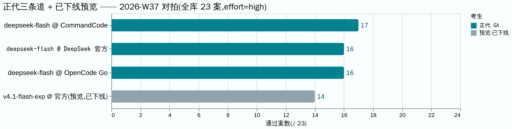
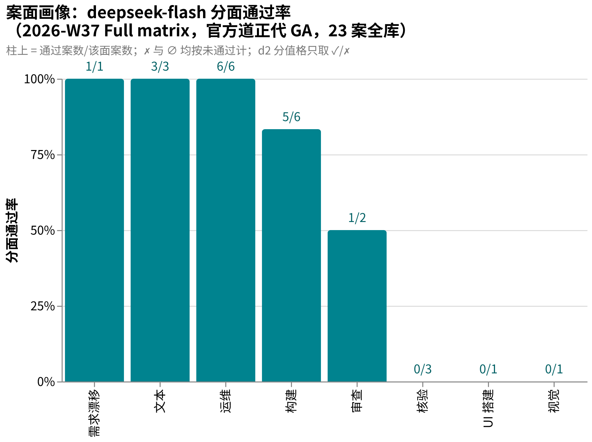

# amber-deepseek

用私有题库 **AMBER** 实测 DeepSeek 官方 API（api.deepseek.com）在售模型（正代、预览版、不同推理档位），只公开结果，不公开题目。
English: [README.en.md](README.en.md)

## 这是什么

- 每期一篇 `results/YYYY-Www.md`：同题、同 harness，对目标模型跑全库；同家族跨版本/跨 provider 并排。
- 一期固定报告：题集规模与哈希、每案找茬分与通过/失败、终端终态、token 用量（若车道上报）与时延、环境指纹、按证据纪律写的定性裁决。
- 题目、oracle、transcript、中间产物**永不公开**（见下「发布纪律」）。
- 姐妹仓：[amber-gpt](https://github.com/getaskclaw/amber-gpt)（GPT 系周测）、[amber-crof](https://github.com/getaskclaw/amber-crof)（CrofAI 周测）、[amber-ollama](https://github.com/getaskclaw/amber-ollama)（Ollama Cloud 周测）、[amber-devin](https://github.com/getaskclaw/amber-devin)（Devin 周测）、[amber-opencode](https://github.com/getaskclaw/amber-opencode)（OpenCode Go 道）、[amber-commandcode](https://github.com/getaskclaw/amber-commandcode)（CommandCode 道）、[amber-workbuddy](https://github.com/getaskclaw/amber-workbuddy)（WorkBuddy ACP 道）、[amber-doubao](https://github.com/getaskclaw/amber-doubao)、[amber-goldenpotato](https://github.com/getaskclaw/amber-goldenpotato)、[amber-kimi](https://github.com/getaskclaw/amber-kimi)、[amber-stepfun](https://github.com/getaskclaw/amber-stepfun)。同一个 deepseek-v4 家族在 CrofAI/Ollama 三方道的成绩见对应仓库；**同名模型跨厂商对拍**（官方道 / OpenCode Go / CommandCode——同名不一定是同一端点）见后两仓。本仓的对照轴是**官方道跨版本**，跨仓引用一律带日期与档位声明。
- AMBER 是 agentic 实战题库（施工/运维/审查/视觉/需求漂移），规范与制题工具见 [getaskclaw/amber](https://github.com/getaskclaw/amber)；考题本体私有。

## 一分钟看懂 W37

同一个 v4.1 脑，GA 当日（2026-09-10）同 high 档、同 23 案同哈希，三条道并排：**CommandCode 17 / DeepSeek 官方 16 / OpenCode Go 16**；灰色的官方预览版（已下线）14 作对照。逐案矩阵、token 账单与退步面都在 [2026-W37 期文](results/2026-W37.md)。图源与 PNG 同目录（`docs/images/`，Vega-Lite）。补记 2026-09-13：同脑另两条道已发布——Ollama 道 17/23（09-11）、WorkBuddy ACP 道 15/23（09-12），见 [amber-ollama](https://github.com/getaskclaw/amber-ollama) / [amber-workbuddy](https://github.com/getaskclaw/amber-workbuddy)。

## 发布纪律（红线）

1. 只发：分数与聚合、token 用量（若车道上报）、速度、定性裁决。
2. 永不发：题目内容、oracle/判分器、transcript、考生工作区、任何能复原题面的中间产物。
3. 每期必钉：模型 ID、effort 档、日期（UTC）、harness 版本、每案内容哈希（bundle_sha）。哈希用于对照 [amber](https://github.com/getaskclaw/amber) 的公开哈希清单，自证题集未变。
4. 案号与题目结构属私有面：公开结果里案例只用稳定别名（A-xxxxxxxx，哈希派生）+ bundle 哈希作句柄；内部案号、变体名、题目描述永不出现。
5. 基调：这是社区实测，不是对厂商的攻击。数据说话，措辞克制。

## 一个方法论前提

同名模型、同 provider，两次跑也可能不同分——推理参数、负载、服务端版本都在漂。预览/实验版模型还有生命周期风险（可能随时下线）。所以这里的一切结论都带日期与档位，且定期重测。单日数字是快照，不是定律。

## 图说数据

- **案面画像**（2026-W37 Full matrix，正代 deepseek-flash GA 当日全库单期，按 face 聚合）：运维 6/6、文本 3/3、施工 5/6 为强项；核验 0/3、视觉 0/1、UI 搭建 0/1 仍挂。逐案矩阵见 [2026-W37 期文](results/2026-W37.md)。
  

## 结果索引

| 期 | 考生 | 成绩（23 案 / 公共子集 21） | 一句话 |
|---|---|---|---|
| [2026-W37](results/2026-W37.md) | **deepseek-flash**（正代，GA 当日） | **16/23**（14/21） | 白卷病与干净审查退步均修复；三道同分带；欠考清单销账；input 0.75M 家族最低带；审查/视觉/UI 三面仍挂 |
| [2026-W37](results/2026-W37.md) | deepseek-v4.1-flash-expires-on-0910（预览，已下线） | 14/23（12/21） | 计分卷零废卷；input≈0731 三方道的 1/30；施工/OPS 强；视觉案误判翻案补考（详期文 Errata/Addenda） |

## 免责

与 DeepSeek（深度求索）无任何隶属/赞助关系。分数是特定周、特定档位的快照，不构成采购建议。
